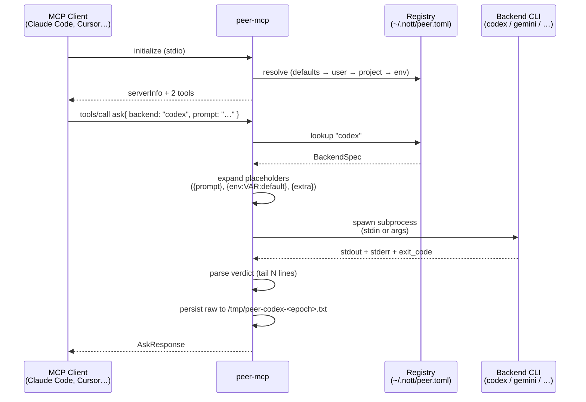
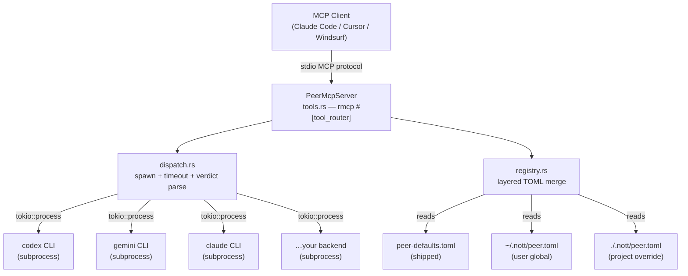

<div align="center">

# peer

## Multi-LLM adversarial review, without the roleplay

**MCP server that dispatches prompts to real peer LLM CLIs — codex, gemini, minimax, claude, and anything you add.**

[](https://github.com/menot-you/peer/actions/workflows/ci.yml)
[](https://docs.rs/menot-you-mcp-peer)

[](https://crates.io/crates/menot-you-mcp-peer)
[](https://www.npmjs.com/package/@menot-you/mcp-peer)
[](https://pypi.org/project/menot-you-mcp-peer/)

[](https://www.rust-lang.org)
[](LICENSE)
[](https://modelcontextprotocol.io)

[Quick Start](#quick-start) · [How It Works](#how-it-works) · [Tools](#tools) · [Registry](#registry) · [Security](#security)

</div>

---

## The Problem

"Multi-model review" is usually **one LLM pretending to be three** — the same
model asked to "now answer as Codex" / "now as Gemini" / "now as a skeptic".
Same training data, same biases, same blind spots. You get the illusion of
consensus with zero diversity.

## The Solution

`peer` is a thin MCP stdio server that dispatches a single prompt to a **real
peer CLI** — `codex`, `gemini`, `claude`, whatever you have installed — as a
subprocess. You get:

- **Real process boundaries** — each backend runs in its own subprocess with
  its own auth, its own model, its own telemetry.
- **Typed exit codes** — `auth_failure`, `timeout`, `binary_not_found`,
  `parse_failure`, `backend_not_found` — not string-matching.
- **Verdict parsing** — best-effort extraction of `LGTM` / `BLOCK` /
  `CONDITIONAL` / `UNKNOWN` from the tail of stdout.
- **Raw artifact** — full stdout persisted to `/tmp/peer-<backend>-<epoch>.txt`
  for later audit.
- **Zero hardcode** — backends live in `~/.nott/peer.toml`, editable without
  a rebuild.

Four CLIs, four processes, four opinions. No roleplay.

## Quick Start

```bash
cargo install menot-you-mcp-peer

# Verify the registry loaded
peer-mcp --list-backends   # or call list_backends() via MCP

# Register with Claude Code / Cursor / any MCP client
# .mcp.json entry:
# {
#   "nott-peer": {
#     "type": "stdio",
#     "command": "peer-mcp",
#     "args": []
#   }
# }
```

From an MCP client:

```json
{
  "tool": "ask",
  "arguments": {
    "backend": "codex",
    "prompt": "Review this diff for correctness. Return LGTM or BLOCK with rationale."
  }
}
```

Returns:

```json
{
  "backend": "codex",
  "verdict": "LGTM",
  "raw": "…full stdout…",
  "elapsed_ms": 206296,
  "exit_code": 0,
  "stderr": "…last 2KB of stderr…",
  "artifact_path": "/tmp/peer-codex-1776442868.txt"
}
```

---

## How It Works



## Architecture



Three files of Rust, one TOML schema, zero hardcoded backends. Adding a new
CLI is a TOML edit, not a code change.

---

## Tools

Two tools. That's the entire surface area.

### `ask`

Dispatch a prompt to a named backend and return raw output + parsed verdict.

**Parameters:**

| Field | Type | Required | Description |
|-------|------|----------|-------------|
| `backend` | string | yes | Registry key (`codex`, `gemini`, `minimax`, `claude`, or custom). |
| `prompt` | string | yes | Prompt content — piped to stdin or substituted via `{prompt}`. |
| `timeout_ms` | number | no | Override backend default. Clamped to `[10_000, 900_000]`. |
| `save_raw` | bool | no | Persist stdout to `/tmp/peer-<backend>-<epoch>.txt`. Default `true`. |
| `extra_args` | string[] | no | Appended to base args, or splatted at `{extra}` placeholder. |
| `extra_env` | object | no | Environment variables layered over backend + process env. |

**Returns:**

```json
{
  "backend": "codex",
  "verdict": "LGTM" | "BLOCK" | "CONDITIONAL" | "UNKNOWN",
  "raw": "full stdout",
  "elapsed_ms": 12345,
  "exit_code": 0,
  "stderr": "last 2KB of stderr",
  "artifact_path": "/tmp/peer-codex-<epoch>.txt"
}
```

**Errors** surface typed `kind` fields for the caller:

| Kind | Meaning |
|------|---------|
| `binary_not_found` | `command` did not resolve via `$PATH` and is not absolute. |
| `auth_failure` | Subprocess exited with `401`/`403`/auth-like stderr pattern. |
| `timeout` | Subprocess exceeded `timeout_ms`. SIGKILL sent. |
| `parse_failure` | Subprocess exited non-zero with no clear auth or timeout signal. |
| `backend_not_found` | `backend` is not present in the resolved registry. |
| `registry_load` | Registry TOML is missing, malformed, or unreadable. |
| `invalid_input` | Request failed validation (empty prompt, bad placeholders). |

### `list_backends`

Enumerate registered backends. Useful for `--fast` / `--backends=` CLI flags
that need to know what's available.

```json
{
  "backends": [
    {
      "name": "codex",
      "description": "OpenAI Codex CLI — forensic code verification",
      "command": "codex",
      "stdin": true,
      "timeout_ms_default": 480000,
      "auth_hint": "run `codex login` if calls return 401/403"
    },
    …
  ],
  "registry_path": "/Users/you/.nott/peer.toml",
  "project_overrides_loaded": false,
  "env_override": false
}
```

---

## Registry

No backend is hardcoded in Rust. The entire registry is TOML.

### Precedence (last wins, keyed by `name`)

1. **Shipped defaults** — `peer-defaults.toml` bundled with the crate. Only
   used for the first-boot copy.
2. **User global** — `~/.nott/peer.toml`. Created on first boot if missing.
3. **Project override** — `./.nott/peer.toml`. Only loaded if the current
   working directory has one.
4. **Env escape hatch** — `$PEER_BACKENDS_TOML=/abs/path.toml` bypasses all
   three and loads only the named file. Useful for tests and CI.

Reset: `rm ~/.nott/peer.toml` and restart the MCP. The shipped defaults are
re-copied.

### Schema

```toml
[[backend]]
name = "codex"                    # required — lookup key
description = "…"                 # surfaced in list_backends
command = "codex"                 # must resolve via $PATH or be absolute
args = ["exec"]                   # base args; supports placeholders
stdin = true                      # prompt via stdin (false → must use {prompt})
timeout_ms_default = 480000       # 480s default; override per-call within clamp
auth_hint = "run `codex login`…"  # shown on auth_failure errors

[backend.env]                     # optional env layered onto the inherited env
EXTRA_VAR = "value"
```

### Placeholders

Any `args` entry can embed:

| Placeholder | Expansion |
|-------------|-----------|
| `{prompt}` | Caller's prompt text. Only valid when `stdin = false`. |
| `{env:VAR}` | Value of `$VAR` at spawn time. Error if unset. |
| `{env:VAR:default}` | Value of `$VAR`, or `default` if unset. |
| `{extra}` | Splat of `extra_args` from the caller. |

Example — pinning a backend to a specific settings file with env fallback:

```toml
[[backend]]
name = "minimax"
command = "claude"
args = [
  "--settings",
  "{env:MINIMAX_SETTINGS:~/.claude/settings.minimax.json}",
  "-p", "{prompt}"
]
stdin = false
timeout_ms_default = 180000
```

### Adding a custom backend

Append to `~/.nott/peer.toml` — no rebuild.

```toml
[[backend]]
name = "kimi"
description = "Moonshot Kimi — long-context outside perspective"
command = "kimi"
args = ["-p", "{prompt}"]
stdin = false
timeout_ms_default = 240000
auth_hint = "set KIMI_API_KEY"

[backend.env]
KIMI_API_KEY = "{env:KIMI_API_KEY}"
```

Restart the MCP. `list_backends` now returns five entries.

---

## Use Cases

### Adversarial review (consensus loop)

Dispatch the same artifact to 3+ backends in parallel from the calling
orchestrator and synthesize. Each backend catches a different bug class —
single-reviewer misses roughly 3/4 of findings vs. 3-reviewer consensus.

### Second opinion (one-shot)

When you're debating A vs B with yourself, dispatch a single `ask` to a
different model family. Independent evidence beats self-debate.

### Cross-model blind-spot hunting

Pair two US-triad models (Claude, GPT) with one outside (Minimax, Kimi,
DeepSeek) to catch convergent framing errors.

---

## Security

Peer runs arbitrary subprocesses on the host. The trust boundary is the
registry file.

- `~/.nott/peer.toml` is **as trusted as the user** — anything listed there
  runs with the MCP's privileges.
- Project-local `.nott/peer.toml` overrides the user global only when the
  MCP starts with that cwd. Review project TOMLs before trusting them.
- Callers control `extra_args` and `extra_env` — they can shape the spawned
  command. Untrusted callers with access to this tool = code execution.
- Outputs land in `/tmp/peer-<backend>-<epoch>.txt` (world-readable by default).
  Disable with `save_raw: false` for sensitive prompts.

See [SECURITY.md](SECURITY.md) for the full threat model, reporting address,
and safe-usage recommendations.

---

## License

AGPL-3.0. See [LICENSE](LICENSE).

Built by [menot-you](https://menot.sh) as part of the `nott` DevOps-for-AI
platform.
