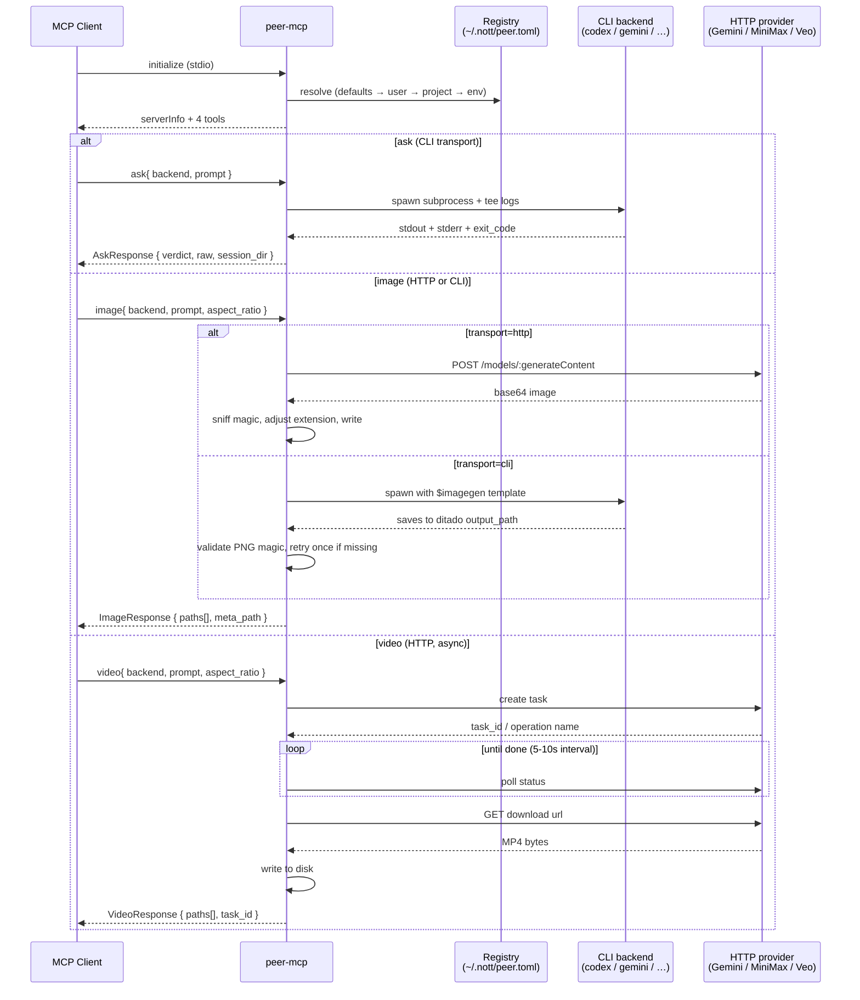
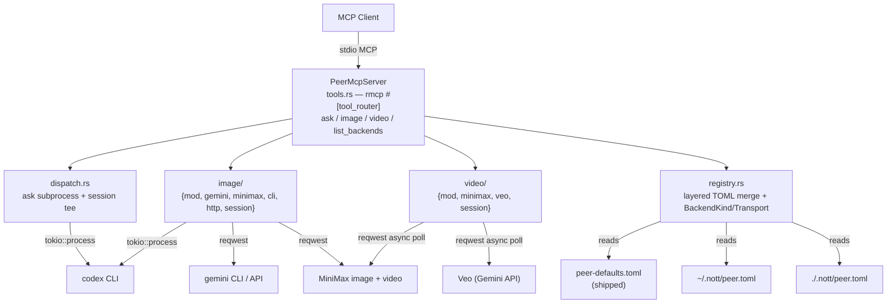

<div align="center">

# peer

## Multi-LLM adversarial review — plus image and video generation — without the roleplay

**MCP server that dispatches prompts to real peer LLM CLIs (codex, gemini, minimax, claude, …) and image/video APIs (Nano Banana, MiniMax image-01 / video-01 / Hailuo-02, Veo, codex `$imagegen`).**

[](https://github.com/menot-you/peer/actions/workflows/ci.yml)
[](https://docs.rs/menot-you-mcp-peer)

[](https://crates.io/crates/menot-you-mcp-peer)
[](https://www.npmjs.com/package/@menot-you/mcp-peer)
[](https://pypi.org/project/menot-you-mcp-peer/)

[](https://www.rust-lang.org)
[](LICENSE)
[](https://modelcontextprotocol.io)

[Quick Start](#quick-start) · [How It Works](#how-it-works) · [Tools](#tools) · [Registry](#registry) · [Security](#security)

</div>

---

## The Problem

"Multi-model review" is usually **one LLM pretending to be three** — the same
model asked to "now answer as Codex" / "now as Gemini" / "now as a skeptic".
Same training data, same biases, same blind spots. You get the illusion of
consensus with zero diversity.

Media generation has a parallel problem: a pile of single-purpose MCPs
(one for Nano Banana, one for MiniMax, one for Veo) each with its own
auth story, its own output path convention, its own quirks. Switching
providers means rewiring three agents.

## The Solution

`peer` is a thin MCP stdio server that exposes **four tools** on top of a
single TOML backend registry:

- **`ask`** — dispatch a prompt to a real peer CLI (`codex`, `gemini`,
  `claude`, …) as a subprocess. Typed exit codes, verdict parsing, live
  stdout/stderr session logs.
- **`image`** — generate or edit images via Nano Banana (Gemini HTTP),
  MiniMax `image-01` (HTTP), or codex (`$imagegen` convention via CLI).
  Magic-byte extension sniff. Saves to `{project_root}/.nott/generated/images/`.
- **`video`** — generate videos via MiniMax video-01 / Hailuo-02 or
  Google Veo 3 (both async: create task → poll → download). Saves to
  `{project_root}/.nott/generated/videos/`.
- **`list_backends`** — enumerate registered backends with capabilities,
  transport, auth status.

One registry. One auth config. Same session pattern. No roleplay, no
rewiring.

- **Real process boundaries** — each `ask` backend runs in its own
  subprocess with its own auth, telemetry, and failure modes.
- **Transport diversity** — HTTP for image/video APIs, CLI for agent
  LLMs. One `BackendSpec` schema drives both.
- **Typed exit codes** — `auth_failure`, `timeout`, `binary_not_found`,
  `missing_api_key`, `http_failure`, `provider_payload`,
  `image_not_produced`, `unsupported_kind`. String matching is for
  amateurs.
- **Artifacts on disk, not in JSON** — image/video bytes are saved;
  responses carry file paths. LLM context windows stay intact.
- **Zero hardcode** — backends live in `~/.nott/peer.toml`, editable
  without a rebuild.

## Quick Start

```bash
cargo install menot-you-mcp-peer

# First boot copies peer-defaults.toml → ~/.nott/peer.toml.
# Restart the MCP if you edit the config.
peer-mcp --help

# Register with Claude Code / Cursor / any MCP client:
# {
#   "nott-peer": {
#     "type": "stdio",
#     "command": "peer-mcp",
#     "args": []
#   }
# }

# Required env vars per backend (set only what you use):
export GOOGLE_AI_API_KEY=...   # nanobanana + veo
export MINIMAX_API_KEY=...     # minimax-image + minimax-video
# codex / gemini / claude CLIs authenticate themselves
```

From an MCP client:

```json
{"tool": "ask",
 "arguments": {"backend": "codex",
               "prompt": "Review this diff for correctness. LGTM or BLOCK."}}

{"tool": "image",
 "arguments": {"backend": "nanobanana",
               "prompt": "a red cube on white, studio lit, 4k",
               "aspect_ratio": "1:1"}}

{"tool": "video",
 "arguments": {"backend": "veo",
               "prompt": "a running horse in slow motion, cinematic",
               "aspect_ratio": "16:9",
               "timeout_ms": 600000}}
```

---

## How It Works



## Architecture



One `BackendSpec` schema covers everything. Adding a new CLI / HTTP
provider is a TOML edit + (for HTTP) a ~200-line provider module.

---

## Tools

### `ask`

Dispatch a prompt to a text LLM backend and return raw output + parsed
verdict. Backend must declare `kinds = ["ask"]` (default).

**Parameters:**

| Field | Type | Required | Description |
|-------|------|----------|-------------|
| `backend` | string | yes | Registry key (`codex`, `gemini`, `minimax`, `claude`, or custom). |
| `prompt` | string | yes | Prompt content — piped to stdin or substituted via `{prompt}`. |
| `timeout_ms` | number | no | Clamp `[10_000, 900_000]`. Fallback: backend default. |
| `save_raw` | bool | no | Persist stdout to session dir. Default `true`. |
| `extra_args` | string[] | no | Appended to base args, or splatted at `{extra}`. |
| `extra_env` | object | no | Environment variables layered over backend + process env. |

**Returns:** `{backend, verdict: "LGTM"|"BLOCK"|"CONDITIONAL"|"UNKNOWN",
raw, elapsed_ms, exit_code, stderr, artifact_path, session_id, session_dir}`.

### `image`

Generate or edit an image. Backend must declare `kinds: ["image"]`.
Saves to `{project_root}/.nott/generated/images/<session_id>.<ext>` by
default; caller can override `output_path`. Magic-byte sniff adjusts
the extension when a provider misreports the mime type.

**Parameters:**

| Field | Type | Required | Description |
|-------|------|----------|-------------|
| `backend` | string | yes | `nanobanana`, `minimax-image`, `codex`, or custom. |
| `prompt` | string | yes | Text prompt (or fallback for `edit_prompt` when editing). |
| `action` | string | no | `"generate"` (default) or `"edit"`. Auto-promotes to `edit` when `edit_prompt`+`input_path` are both set. |
| `edit_prompt` | string | no | Edit instruction. |
| `input_path` | string | no | Existing image path. Required when `action="edit"`. |
| `output_path` | string | no | Override. Default `{project_root}/.nott/generated/images/<session_id>.png`. |
| `aspect_ratio` | string | no | `"1:1" / "16:9" / "9:16" / "4:3" / "3:4"`. |
| `model` | string | no | Override backend default model. |
| `reference_images` | string[] | no | Additional images for style (Nano Banana only). |
| `n` | number | no | Number of images. CLI backends support `n=1` only. |
| `timeout_ms` | number | no | Clamp `[10_000, 900_000]`. |

**Returns:** `{backend, model, aspect_ratio, paths[], session_id,
meta_path, elapsed_ms, stderr_tail?}`.

### `video`

Generate a video (async). Backend must declare `kinds: ["video"]`.
Saves to `{project_root}/.nott/generated/videos/<session_id>.mp4` by
default.

**Parameters:**

| Field | Type | Required | Description |
|-------|------|----------|-------------|
| `backend` | string | yes | `minimax-video`, `veo`, or custom. |
| `prompt` | string | yes | Text prompt. |
| `first_frame_image` | string | no | Path to conditioning image (MiniMax only). |
| `output_path` | string | no | Override. Default `{project_root}/.nott/generated/videos/<session_id>.mp4`. |
| `aspect_ratio` | string | no | Veo accepts `"16:9" / "9:16"`. MiniMax ignores. |
| `model` | string | no | Override backend default model. |
| `timeout_ms` | number | no | Wall-clock budget for the whole async flow. Default 600 s. |

**Returns:** `{backend, model, paths[], session_id, meta_path,
elapsed_ms, task_id?}`. `task_id` is the provider-assigned id
(MiniMax task id or Veo operation name) for post-mortem debugging.

### `list_backends`

Enumerate all registered backends with capabilities:

```json
{
  "backends": [
    {
      "name": "codex",
      "description": "...",
      "command": "codex",
      "stdin": true,
      "timeout_ms_default": 480000,
      "auth_hint": "run `codex login`…",
      "kinds": ["ask", "image"],
      "transport": "cli",
      "provider": null,
      "model": null,
      "api_key_env": null,
      "aspect_ratio_default": null,
      "status": "ok"
    }
  ],
  "registry_path": "/Users/you/.nott/peer.toml",
  "project_overrides_loaded": false,
  "env_override": false
}
```

`status` is `"ok"` for backends with no `api_key_env` or when the env
var is set and non-empty. Otherwise `"missing_key"`.

### Typed error kinds

Surfaced in the MCP error `data.kind` field:

| Kind | Meaning |
|------|---------|
| `binary_not_found` | CLI command did not resolve via `$PATH`. |
| `auth_failure` | Subprocess exited 401/403 or auth-like stderr. |
| `timeout` | Subprocess or async wait exceeded `timeout_ms`. |
| `parse_failure` | Subprocess stdout is not valid UTF-8. |
| `backend_not_found` | `backend` is not present in the resolved registry. |
| `registry_load` | Registry TOML is missing, malformed, or unreadable. |
| `invalid_input` | Request validation failed. |
| `missing_api_key` | HTTP backend's `api_key_env` is unset. |
| `http_failure` | HTTP call returned non-success, or provider reported API-level error. |
| `provider_payload` | Provider JSON shape could not be parsed. |
| `image_not_produced` | CLI image backend finished but target file missing / invalid. |
| `unsupported_kind` | Requested tool kind not declared in backend's `kinds`. |

---

## Registry

No backend is hardcoded in Rust. The entire registry is TOML.

### Precedence (last wins, keyed by `name`)

1. **Shipped defaults** — `peer-defaults.toml` bundled with the crate.
   Only used for the first-boot copy.
2. **User global** — `~/.nott/peer.toml`. Created on first boot.
3. **Project override** — `./.nott/peer.toml`. Loaded if the cwd has one.
4. **Env escape hatch** — `$PEER_BACKENDS_TOML=/abs/path.toml` bypasses
   all three and loads only the named file (tests / CI).

Reset: `rm ~/.nott/peer.toml` and restart the MCP.

### Schema

```toml
[[backend]]
name = "codex"                    # required — lookup key
description = "…"                 # surfaced in list_backends
command = "codex"                 # CLI transport: must resolve via $PATH
                                  # HTTP transport: free-form label
args = ["exec"]                   # base args; supports placeholders
stdin = true                      # prompt via stdin (false → use {prompt})
timeout_ms_default = 480000       # default; clamped per-call to [10s, 900s]
auth_hint = "run `codex login`…"  # shown on auth_failure errors

# Tool surface. Default ["ask"] when omitted (backward-compat).
kinds = ["ask", "image"]

# Transport. Default "cli" when omitted.
transport = "cli"  # or "http"

# Image + video fields (optional; only meaningful for image/video kinds)
provider = "gemini"                 # http providers: "gemini" | "minimax" | …
model = "gemini-3.1-flash-image-preview"
api_key_env = "GOOGLE_AI_API_KEY"
base_url = "https://generativelanguage.googleapis.com/v1beta"
aspect_ratio_default = "16:9"

# CLI image-specific (codex $imagegen convention)
image_template = "$imagegen {prompt}. Salve em {output_path}"
image_edit_template = "$imagegen {edit_prompt}. Salve em {output_path}"
image_edit_prefix_args = ["-i", "{input_path}"]
image_extra_args = ["--full-auto"]   # argv added ONLY on image dispatch

[backend.env]                        # optional env layered onto inherited env
EXTRA_VAR = "value"
```

### Placeholders

Any `args` entry or image/edit template can embed:

| Placeholder | Expansion |
|-------------|-----------|
| `{prompt}` | Caller prompt. |
| `{edit_prompt}` | Edit instruction (image edit templates only). |
| `{output_path}` | Resolved artifact path (image templates). |
| `{input_path}` | Input image (image edit templates). |
| `{env:VAR}` | `$VAR` at spawn time. |
| `{env:VAR:default}` | `$VAR`, or `default`. |
| `{extra}` | Splat of caller `extra_args`. |

### Adding a custom backend

Append to `~/.nott/peer.toml` — no rebuild.

```toml
# Text LLM
[[backend]]
name = "kimi"
command = "kimi"
args = ["-p", "{prompt}"]
stdin = false
timeout_ms_default = 240000
auth_hint = "set KIMI_API_KEY"
kinds = ["ask"]
[backend.env]
KIMI_API_KEY = "{env:KIMI_API_KEY}"

# HTTP image provider
[[backend]]
name = "flux-pro"
command = "flux-pro"                 # free-form, unused for http
kinds = ["image"]
transport = "http"
provider = "flux"                    # requires matching Rust module
model = "flux-1.1-pro"
api_key_env = "BFL_API_KEY"
base_url = "https://api.bfl.ml/v1/flux-pro-1.1"
```

Restart the MCP. `list_backends` now returns the new entries.

> Adding a new HTTP provider requires a matching module under
> `src/image/` or `src/video/` — the dispatcher uses `provider` as a
> discriminator. PRs welcome.

---

## Use Cases

### Adversarial review

Dispatch the same artifact to 3+ backends in parallel from the
orchestrator and synthesize. Each model catches a different bug class.

### Second opinion

Single `ask` to a different model family when self-debate stalls.

### Brand asset generation

`image` with `nanobanana` for hero shots + `codex` when you want the
agent to iterate on variants until a critic is satisfied.

### Demo / promo videos

`video` with `veo` for stock-quality footage + `minimax-video` for
image-to-video using a hand-crafted first frame. Output lands in
`.nott/generated/videos/` alongside the code — commit the seed prompt,
regenerate on demand.

---

## Security

Peer runs arbitrary subprocesses AND makes arbitrary HTTPS calls using
env-var API keys. The trust boundary is the registry file.

- `~/.nott/peer.toml` is **as trusted as the user** — CLI entries run
  with the MCP's privileges; HTTP entries make network calls to the
  `base_url` with `api_key_env` secrets attached.
- Project-local `.nott/peer.toml` overrides the user global only when
  the MCP starts with that cwd. Review project TOMLs before trusting them.
- Callers control `extra_args` / `extra_env` — they can shape the
  spawned command. Untrusted callers = code execution.
- API keys live in env vars (never in the TOML). Rotate via
  `export <VAR>=...` and restart the MCP.
- Image / video artifacts land in `{project_root}/.nott/generated/`
  (typically world-readable within your user). Add to `.gitignore` if
  you don't want them tracked — by default nothing is auto-committed.
- No secret ever returns to the MCP client — responses carry file paths,
  not credentials or bytes.

See [SECURITY.md](SECURITY.md) for the full threat model.

---

## License

AGPL-3.0. See [LICENSE](LICENSE).

Built by [menot-you](https://menot.sh) as part of the `nott` DevOps-for-AI
platform.
